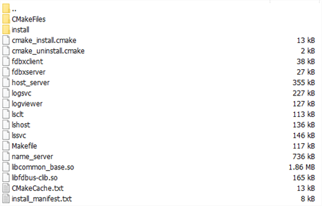
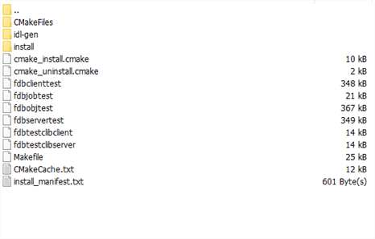
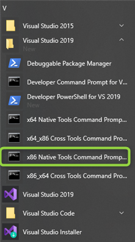
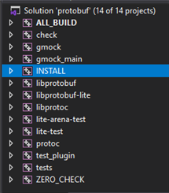

# FDBus - Quick Guide

[FDBus](https://github.com/jeremyczhen/fdbus) is a middleware development framework targeting the following objectives:

* Inter-Process Communication (IPC) within single host and cross the network
* System abstraction (Windows, Linux, QNX)
* Components based on which middleware is built (job, worker, timer, watch...)

## Build&run fdbus

cmake, gcc should be install

### Build on Ubuntu host

* create work director

```shell
mkdir ~/workspace
cd ~/workspace
```

* download and build protobuf

```shell
git clone https://github.com/protocolbuffers/protobuf.git
cd protobuf
git submodule update --init --recursive
mkdir -p build/install
cd build

cmake -DCMAKE_INSTALL_PREFIX=install -DBUILD_SHARED_LIBS=1 ../cmake
make -j4 install
```

* download and build fdbus

```shell
cd ~/workspace
git clone https://github.com/jeremyczhen/fdbus.git
cd fdbus
mkdir -p build/install
cd build
cmake -DCMAKE_INSTALL_PREFIX=install ../cmake
make install
```



* build fdbus example

```shell
cd ~/workspace/fdbus
mkdir -p build-example/install
cd build-example
cmake -DSYSTEM_ROOT="~/workspace/protobuf/build/install;~/workspace/fdbus/build/install" -DCMAKE_INSTALL_PREFIX=install ../cmake/pb-example

PATH=~/workspace/protobuf/build/install/bin:$PATH make install
```



### Run on Ubuntu host

* Run fdbus `name_server`

```shell
cd ~/workspace/build
./name_server
```

* Run test server

```shell
cd ~/workspace/build-example

# start test server
./fdbservertest my_test
```

* Run test client

```shell
cd ~/workspace/build-example

# start test client
./fdbclienttest my_test
```

* Run log server

```shell
cd ~/workspace/build
# start log server and output log in STDOUT
./logsvc
```

### Build on Window host

install CMake, Visual Studio

* start command prompt

Window start menu -> Visual Studio 2019 -> x86 Native Tools Command Prompt for VS 2019



* create work director

```dos
d:
mkdir workspace & cd workspace
```

* download and build protobuf

```dos
git clone https://github.com/protocolbuffers/protobuf.git
cd protobuf
git submodule update --init --recursive
mkdir cbuild & cd cbuild & mkdir install & cd ..\cbuild

cmake -DCMAKE_INSTALL_PREFIX=install -Dprotobuf_WITH_ZLIB=OFF ..\cmake
```

open `protobuf.sln` in `cbuild` folder, and build sub project `INSTALL`.



* download and build fdbus

```dos
d:
cd D:\workspace
git clone https://github.com/jeremyczhen/fdbus.git
cd fdbus
mkdir build & cd build & mkdir install & cd ..\build

cmake -DCMAKE_INSTALL_PREFIX=install ..\cmake
```

open `fdbus.sln` in folder `build`, and build sub project `INSTALL`


### Build with buildCentral

Please follow guide on https://github.com/jeremyczhen/fdbus#build-with-buildcentral

Here list basic steps:

* Download buildCentral
  
```shell
cd ~/workspace
git clone https://github.com/jeremyczhen/buildCentral.git
```

* Enter buildCentral/workspace to download FDBus and protobuf

```shell
cd ~/workspace/buildCentral/workspace
git clone https://github.com/jeremyczhen/fdbus.git
git clone https://github.com/jeremyczhen/protobuf.git
```

* Build

```shell
cd ~/workspace/buildCentral
tools/buildCentral/install/mk -thost
```

* Get compiled files on `output/stage/host`

```
└── host
    ├── bin
    ├── include
    │   └── google
    ├── lib
    │   ├── cmake
    │   └── pkgconfig
    └── usr
        ├── bin
        ├── include
        └── lib
```

* Run

```shell
# go to fdbus bin folder
cd ~/workspace/buildCentral/output/stage/host/usr/bin

# set LD_LIBRARY_PATH to include fdbus lib
LD_LIBRARY_PATH=~/workspace/buildCentral/output/stage/host/usr/lib:$LD_LIBRARY_PATH

# start name server
./name_server
```